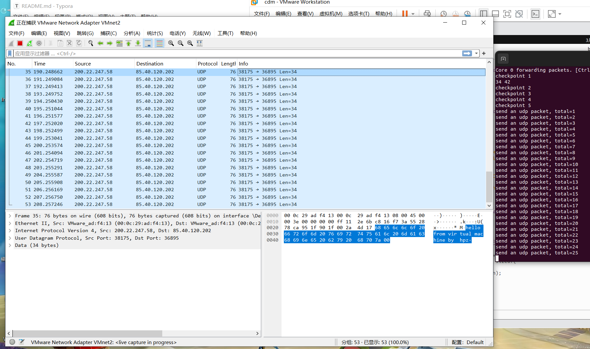

## Lab2: send and receive packets with DPDK

#### 521021910454 黄培正

### 1. 问题解答

- Q1: What's the purpose of using hugepage?

  - 减少 TLB 缓存项的使用，从而大大降低 TLB Miss 的概率。
  - 减少页表的级数，从而提升查询页表的效率。

- Q2: Take examples/helloworld as an example, describe the execution flow of DPDK programs?

  答：helloworld 代码如下所示。

  ```c
  int main(int argc, char **argv)
  {
     int ret;
     unsigned lcore_id;

     ret = rte_eal_init(argc, argv);
     if (ret < 0)
        rte_panic("Cannot init EAL\n");

     /* call lcore_hello() on every worker lcore */
     RTE_LCORE_FOREACH_WORKER(lcore_id) {
        rte_eal_remote_launch(lcore_hello, NULL, lcore_id);
     }

     /* call it on main lcore too */
     lcore_hello(NULL);
     rte_eal_mp_wait_lcore();

     /* clean up the EAL */
     rte_eal_cleanup();
     return 0;
  }
  ```

  控制流如下：

  1. 调用`rte_eal_init`，初始化基础运行环境，若初始化失败则报错。
  2. 对多核运行初始化。即遍历 EAL 指定可以使用的 lcore，然后通过`rte_eal_remote_launch`在每个 lcore 上，启动被指定的线程。
  3. 运行当前线程的函数 locore_hello。
  4. 主线程等待从线程结束执行。
  5. 执行`rte_eal_cleanup`，释放资源，防止 hugepage 内存泄漏。

- Q3: Read the codes of examples/skeleton, describe DPDK APIs related to sending and receiving packets.

  答：以下分别为收包、发包所对应的 API。通过指定的端口与队列，收/发缓存区中的数据。

         其中，最后一个参数`nb_pkts`为指定一次函数调用来处理的包的个数。当设置为1时，每次收/发一个包。

      	dpdk在样例程序，例如skeleton中，使用了burst模式，即收/发包数量为32个。这样可以减少内存访问，提高性能。

  ```c++
  static inline uint16_t rte_eth_rx_burst(uint8_t port_id, uint16_t queue_id,
  struct rte_mbuf **rx_pkts, const uint16_t nb_pkts)
  ```

  ```c++
  static inline uint16_t rte_eth_tx_burst(uint8_t port_id, uint16_t queue_id,
  struct rte_mbuf **tx_pkts, uint16_t nb_pkts)
  ```

- Q4: Describe the data structure of ‘rte_mbuf’.

- 答：`rte_mbuf`的结构如下所示。

  

  - `headroom`为`mbuf`头部与实际包数据的一段空间，存储控制信息、帧内容、事件等。`headroom`的起始地址保存在`buff_addr`指针中。
  - 在`headroom`后为实际数据所占空间。数据帧的长度可通过调用`pkt_len(m)`或`data_len(m)`获得。
  - 实际数据后剩余的空间为`tailroom`。通过`headroom`与`tailroom`，可方便应用解封报文。
  - `pkt`的`next`字段指向下一个 segment 的地址；`buf_addr`指向`headroom`的起始地址；`rte_pktmbuf_mtod(m)`指向实际 data 的起始地址。
  - 此外，还记录了所属的 mempool，时间戳，端口，私有数据大小等信息。

### 2. 检验正确性

主要代码如下：

```c
uint16_t port;

    /*
     * Check that the port is on the same NUMA node as the polling thread
     * for best performance.
     */
    RTE_ETH_FOREACH_DEV(port)
    if (rte_eth_dev_socket_id(port) >= 0 &&
        rte_eth_dev_socket_id(port) !=
        (int) rte_socket_id())
        printf("WARNING, port %u is on remote NUMA node to "
               "polling thread.\n\tPerformance will "
               "not be optimal.\n", port);

    printf("\nCore %u forwarding packets. [Ctrl+C to quit]\n", rte_lcore_id());

    char *package_data = "hello from virtual machine by hpz";
    int data_len = strlen(package_data) + 1;


    /* Run until the application is quit or killed. */

    port = 0; // only use port 0

    struct rte_mbuf *buf[1];
    buf[0] = rte_pktmbuf_alloc(mbuf_pool); //分配空间
    int hdr_len = sizeof(
                          struct rte_ether_hdr) + sizeof(
                          struct rte_ipv4_hdr) + sizeof(
                          struct rte_udp_hdr);
    rte_pktmbuf_append(buf[0], data_len + hdr_len);

    puts("checkpoint 1");
    printf("%d %d\n", data_len, hdr_len);

    /* 构造包 ether+ip+udp*/
    struct rte_ether_hdr *eth_hdr = rte_pktmbuf_mtod(buf[0],
    struct rte_ether_hdr *);
    struct rte_ipv4_hdr *ip_hdr = rte_pktmbuf_mtod_offset(buf[0],
    struct rte_ipv4_hdr *, sizeof(struct rte_ether_hdr));
    struct rte_udp_hdr *udp_hdr = rte_pktmbuf_mtod_offset(buf[0],
    struct rte_udp_hdr *, sizeof(struct rte_ether_hdr) + sizeof(struct rte_ipv4_hdr));

    puts("checkpoint 2");

    /* 构造ethernet header */
    struct rte_ether_addr mac_addr;
    rte_eth_macaddr_get(0, &mac_addr);
    eth_hdr->ether_type = rte_cpu_to_be_16(RTE_ETHER_TYPE_IPV4);
    eth_hdr->s_addr = mac_addr;
    eth_hdr->d_addr = mac_addr;

    puts("checkpoint 3");

    /* 构造ip header */
    ip_hdr->version_ihl = RTE_IPV4_VHL_DEF;
    ip_hdr->type_of_service = 0; // unused
    ip_hdr->total_length = 62 << 8; // calc by data length
    ip_hdr->packet_id = 0;
    ip_hdr->fragment_offset = 0;
    ip_hdr->time_to_live = 255;
    ip_hdr->next_proto_id = 17; // udp
    ip_hdr->src_addr = IPv4(58, 247, 22, 200);
    ip_hdr->dst_addr = IPv4(202, 120, 40, 85);
    ip_hdr->hdr_checksum = rte_ipv4_cksum(ip_hdr);

    puts("checkpoint 4");

    /* 构造udp header */
    udp_hdr->src_port = 8085;
    udp_hdr->dst_port = 8080;
    udp_hdr->dgram_len = (data_len + sizeof(struct rte_udp_hdr)) << 8;
    udp_hdr->dgram_cksum = rte_ipv4_udptcp_cksum(ip_hdr, udp_hdr);

    puts("checkpoint 5");

    void *tmp = rte_pktmbuf_mtod_offset(buf[0],
    void *, hdr_len);
    memcpy(tmp, package_data, data_len);

    int total = 0;
    int interval = 1;
    for (;;) {
        const uint16_t nb_rx = rte_eth_tx_burst(port, 0, buf, 1); //每次发一个包
        total++;
        printf("send an udp packet, total=%d\n", total);
        sleep(interval);
    }

    /* Free packets. */
    rte_pktmbuf_free(buf[0]);
```

执行命令：

```
cd dpdk
sudo meson -D examples=all build
cd build
sudo ninja install
cd examples
sudo ./dpdk-skeleton
```

通过 wireshark，我们可以监听来自虚拟机的 UDP 包，且 UDP 包可以正常解析，内容正确。



### References

[1] 深入浅出 dpdk chapter1.7 实例讲解

[2] 深入浅出 dpdk chapter6.6 Mbuf 与 Mempool

[3] https://blog.csdn.net/XuVowkin/article/details/117064512

[4] DPDK 总结之常用 API https://blog.csdn.net/gerald_jones/article/details/106600175

[5] DPDK 基础模块之 rte_mbuf 详解 https://www.cnblogs.com/ziding/p/4214499.html

[6] https://en.wikipedia.org/wiki/IPv4
